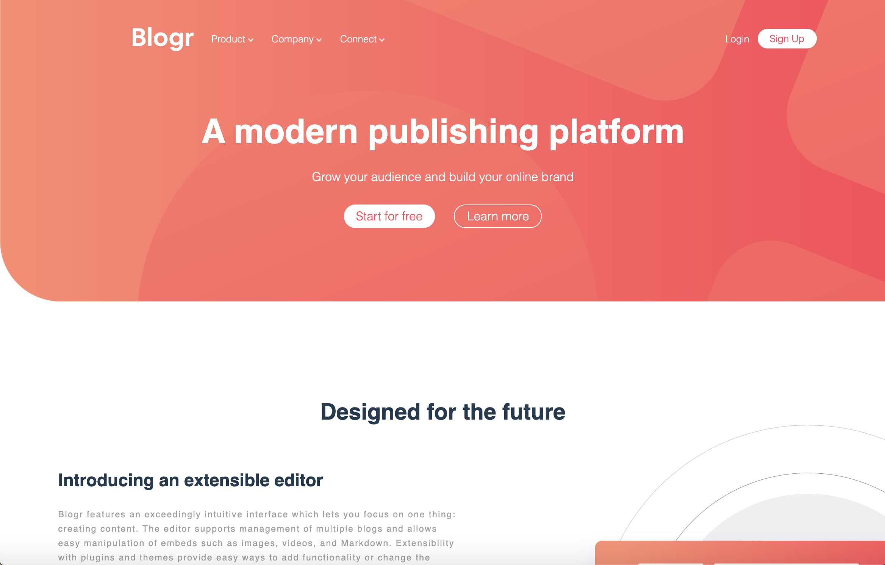

# Frontend Mentor - Blogr landing page solution

This is a solution to the [Blogr landing page challenge on Frontend Mentor](https://www.frontendmentor.io/challenges/blogr-landing-page-EX2RLAApP). Frontend Mentor challenges help you improve your coding skills by building realistic projects. 

## Table of contents

- [Overview](#overview)
  - [The challenge](#the-challenge)
  - [Screenshot](#screenshot)
  - [Links](#links)
- [My process](#my-process)
  - [Built with](#built-with)
  - [What I learned](#what-i-learned)
  - [Useful resources](#useful-resources)
- [Author](#author)
- [Acknowledgments](#acknowledgments)

**Note: Delete this note and update the table of contents based on what sections you keep.**

## Overview

### The challenge

Users should be able to:

- View the optimal layout for the site depending on their device's screen size
- See hover states for all interactive elements on the page

### Screenshot

### Links

- Solution URL: [https://github.com/hankthemason/blogr-landing-page-main](https://github.com/hankthemason/blogr-landing-page-main)
- Live Site URL: [https://hankthemason.github.io/blogr-landing-page-main](https://hankthemason.github.io/blogr-landing-page-main/)

## My process

### Built with

- Semantic HTML5 markup
- CSS custom properties
- Flexbox
- CSS Grid
- Mobile-first workflow

### What I learned

One of the major things I struggled with in this project was positioning the logos and other images, and making them responsive as well.  At first I put them in using 'background-image' properties, but realized that this way I didn't have a lot of control over how the images would behave when the screen size changed.  I then hard-coded them in as individual  elements, giving me a lot more control over the images and their responsiveness.

I used flexbox extensively in this project and relied on it heavily for the changes that occur with smaller screen-sizes (e.g. switching from a 'row' orientation to a 'column' orientation with smaller screens).  

This project featured a lot of cool hover effects as well, and made me really think about how to change elements and give them different states when necessary.

## Author

- Website - [home](https://www.github.com/hankthemason)
- Frontend Mentor - [@hankthemason](https://www.frontendmentor.io/profile/hankthemason)
